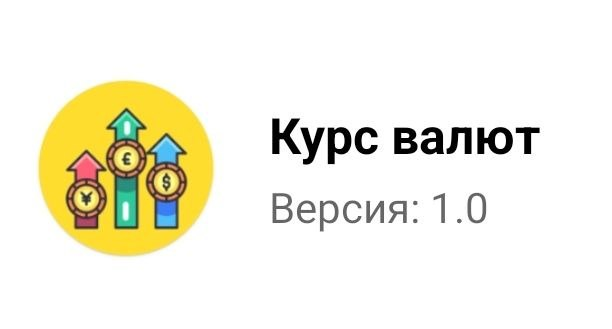
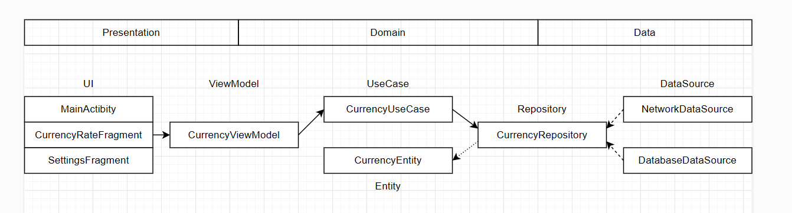
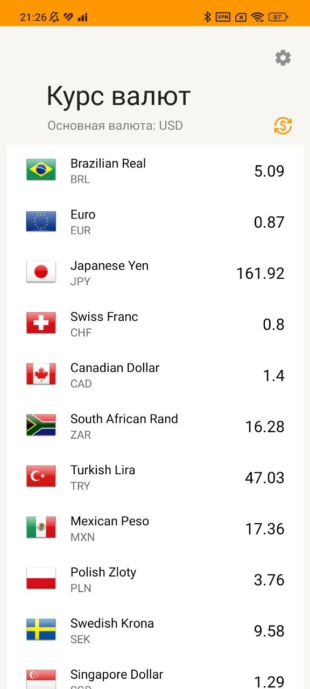
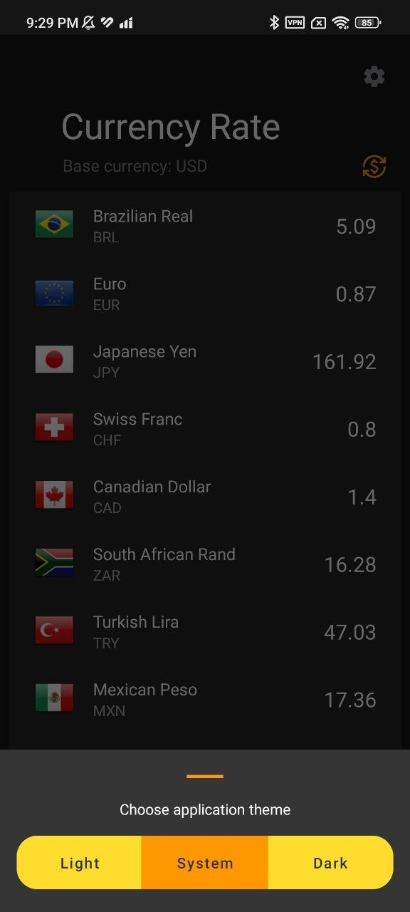

# Currency Rate Tracker

<p align="center">
  
</p>

**Currency Rate Tracker** — Android-приложение для отслеживания курсов валют в реальном времени.

## 📋 Содержание

- [Описание](#-описание)
- [Возможности](#-возможности)
- [Технологии](#-технологии)
- [Архитектура](#-архитектура)
- [Требования](#-требования)
- [Установка](#-установка)
- [Скриншоты](#-скриншоты)

---

## 📖 Описание

Приложение позволяет просматривать актуальные курсы валют, переключать языковые темы и настраивать внешний вид интерфейса.

## ✨ Возможности

- Отображение актуальных курсов валют
- Поддержка нескольких языков
- Светлая и тёмная темы оформления
- Интуитивно понятный интерфейс
- Настройки приложения

## 🛠 Технологии

| Технология | Назначение |
|---|---|
| **Kotlin** | Основной язык разработки |
| **MVVM** | Паттерн архитектуры |
| **Hilt** | Dependency Injection |
| **Retrofit** | Сетевые запросы |
| **Glide** | Загрузка изображений |
| **ViewBinding** | Привязка view |
| **Navigation Component** | Навигация между экранами |
| **Material Design** | UI-компоненты |

## 🏗 Архитектура

Проект построен по паттерну **MVVM** с использованием **Hilt** для dependency injection.



## 📱 Требования

- **Android SDK 24** (Android 7.0 Nougat) и выше
- **Android Studio** Hedgehog (или новее)
- **JDK 8** или выше

## 🚀 Установка

1. Клонировать репозиторий:

```bash
git clone https://github.com/shadi777/currency-rate-tracker.git
```

2. Открыть проект в **Android Studio**

3. Синхронизировать Gradle-файлы

4. Запустить на эмуляторе или устройстве:

```bash
./gradlew installDebug
```

## 📸 Скриншоты

### Светлая тема

Главный экран приложения в светлой теме:



### Тёмная тема

Тёмная тема, другой язык, экран настроек:



---

**Author:** [shadi777](https://github.com/shadi777)
